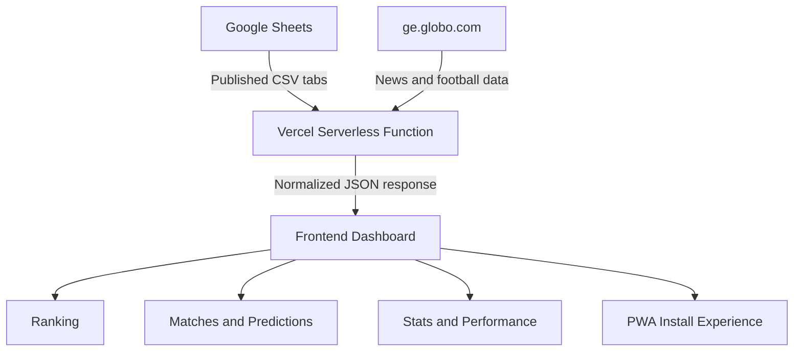

# 🏆 Bolão NEXA 2026

<p align="center">
  
</p>

<h3 align="center">
  A World Cup prediction pool dashboard built for NEXA Projetos.
</h3>

<p align="center">
  <strong>Live ranking · Match predictions · Player statistics · PWA · Google Sheets automation · Vercel Serverless API</strong>
</p>

<p align="center">
  <a href="https://bolaonexa2026.vercel.app/">
    
  </a>
  
  = 20" />
  
  
</p>

---

## 📌 About the Project

**Bolão NEXA 2026** is a web dashboard created to follow a 2026 World Cup prediction pool between friends and coworkers from **NEXA Projetos**.

The project centralizes ranking, match results, predictions, champion picks, group standings, top scorers, news and knockout stage information in a responsive, installable and easy-to-maintain interface.

It was built with a practical MVP approach: **Google Sheets works as the data source**, a **Vercel Serverless Function** fetches and normalizes the data, and the frontend renders everything in a custom dashboard using **HTML, CSS and Vanilla JavaScript**.

### 🇧🇷 Descrição em Português

O **Bolão NEXA 2026** é um painel interativo criado para acompanhar o bolão da Copa do Mundo entre amigos da **NEXA Projetos**, reunindo classificação, jogos, palpites, estatísticas, notícias, artilharia e chaveamento em um dashboard visual, responsivo e instalável como app.

---

## 🚀 Live Project

🔗 **Live Demo:** [https://bolaonexa2026.vercel.app/](https://bolaonexa2026.vercel.app/)

---

## ✨ Main Features

- 📊 Live ranking dashboard
- ⚽ Match list with scores and prediction details
- 🎯 Exact score and correct result indicators
- 🏅 Champion prediction cards
- 📈 Participant performance by day and round
- 🌎 World Cup group standings
- 🥉 Best third-placed teams section
- 🧩 Knockout stage bracket
- 🔥 Top scorers section
- 📰 World Cup news from ge
- 🇧🇷 Brazil-related news section
- ⭐ Neymar-related news filter
- 📱 Installable Progressive Web App
- 🔄 Automatic updates from Google Sheets CSV
- ☁️ Serverless API hosted on Vercel
- 🛡️ Basic security header configuration
- 🎨 Fully custom responsive interface

---

## 🧠 How It Works



The project follows a simple and low-cost architecture:

1. The pool data is maintained in Google Sheets.
2. Specific spreadsheet tabs are published as CSV.
3. The serverless API fetches CSVs and external football news.
4. The frontend parses, normalizes and displays the information.
5. The app can be installed on mobile devices as a PWA.

---

## 🛠️ Tech Stack

### Frontend

| Technology | Usage |
|---|---|
| HTML5 | Page structure |
| CSS3 | Custom layout, cards, responsive grids and visual identity |
| Vanilla JavaScript | Data parsing, rendering and UI interactions |
| Google Fonts | Typography |
| PWA Manifest | Mobile install behavior |
| Service Worker | Network-first strategy and fallback cache |

### Backend / API

| Technology | Usage |
|---|---|
| Node.js | Serverless runtime |
| Vercel Serverless Functions | API endpoint for data aggregation |
| Fetch API | External data requests |
| CommonJS | Function export format |
| CSV Parsing | Reading Google Sheets published data |
| HTML Parsing | Extracting news/top scorers from external pages |

### Data & Integrations

| Source | Usage |
|---|---|
| Google Sheets | Main pool database |
| Published CSV files | Ranking, matches, predictions and performance data |
| ge.globo.com | World Cup news and football information |
| External assets | Flags, icons and visual elements |

### Deployment

| Tool | Usage |
|---|---|
| GitHub | Source code hosting |
| Vercel | Hosting and serverless deployment |
| Vercel CLI | Local development with `vercel dev` |

---

## 📁 Project Structure

```bash
bolao_nexa_2026/
├── api/
│   └── bolao.js
├── icons/
│   ├── icon-192.png
│   ├── icon-512.png
│   └── maskable-512.png
├── index.html
├── manifest.webmanifest
├── package.json
├── service-worker.js
├── vercel.json
└── README.md
```

---

## 📄 Main Files

| File | Description |
|---|---|
| `index.html` | Main dashboard, layout, styles and frontend logic |
| `api/bolao.js` | Vercel Serverless Function responsible for fetching Google Sheets CSVs and external news |
| `manifest.webmanifest` | PWA metadata, theme, icons and shortcuts |
| `service-worker.js` | Network-first Service Worker strategy |
| `vercel.json` | Vercel function configuration and security headers |
| `package.json` | Project metadata, scripts and Node.js engine definition |

---

## ⚙️ Requirements

- Node.js `>= 20`
- Vercel account
- GitHub repository connected to Vercel
- Google Sheets published as CSV
- No paid API required

---

## ▶️ Running Locally

Install the Vercel CLI:

```bash
npm install -g vercel
```

Clone the repository:

```bash
git clone https://github.com/yruamkaffer/bolao_nexa_2026.git
```

Access the project folder:

```bash
cd bolao_nexa_2026
```

Run locally:

```bash
npm run dev
```

The project uses:

```bash
vercel dev
```

---

## ✅ Syntax Check

To validate the serverless function syntax:

```bash
npm run check
```

This command runs:

```bash
node -c api/bolao.js
```

---

## 🔗 Data Source Strategy

The current version uses fixed Google Sheets CSV URLs inside:

```bash
api/bolao.js
```

The API loads data from spreadsheet tabs such as:

- `Classificação`
- `Jogos`
- `Palpites`
- `Desempenho por rodada`
- `Desempenho por dia`

If a tab is renamed in Google Sheets, the matching sheet name must also be updated in the API file.

---

## 📱 PWA Support

This project includes Progressive Web App support through:

- `manifest.webmanifest`
- custom app icons
- standalone display mode
- mobile-first viewport
- installable app behavior
- shortcut links to ranking and match sections
- Service Worker registration

The Service Worker prioritizes fresh network data and falls back to cached content when necessary.

---

## 🎨 UI & Visual Identity

The interface was designed with a World Cup-inspired dashboard style:

- dark navy background
- orange and light-blue highlights
- card-based sections
- responsive grids
- ranking podium emphasis
- match cards with flags
- prediction chips
- knockout bracket
- trophy highlight
- mobile-friendly structure

---

## 📊 Dashboard Sections

The dashboard includes:

- Current ranking
- General statistics
- Recently updated matches
- Full match list
- Predictions by participant
- Exact score and correct result indicators
- Champion picks
- Group standings
- Best third-placed teams
- Knockout bracket
- Top scorers
- World Cup news
- Brazil national team news
- Neymar-related news

---

## 🧪 Project Status

This project is currently a functional MVP deployed on Vercel.

It was built with focus on:

- fast delivery
- low cost
- real-world usage
- easy spreadsheet maintenance
- automatic dashboard updates
- mobile-friendly access
- no paid backend or database dependency

---

## 🧭 Roadmap / Future Improvements

Possible improvements for future versions:

- [ ] Add real screenshots and GIFs to this README
- [ ] Split `index.html` into separate HTML, CSS and JavaScript files
- [ ] Create a dedicated `/src` folder
- [ ] Move data source URLs to a configuration file or environment variables
- [ ] Add unit tests for CSV parsing functions
- [ ] Add GitHub Actions for automated syntax checks
- [ ] Improve error states and loading skeletons
- [ ] Add accessibility improvements
- [ ] Create admin documentation for maintaining the spreadsheet
- [ ] Add a changelog
- [ ] Add a version badge
- [ ] Add a small QA test plan for manual validation
- [ ] Add E2E tests for critical dashboard sections

---

## 🧪 QA Opportunities

This project is also a good candidate for practicing QA documentation and testing.

Possible QA artifacts:

- Manual test cases for ranking updates
- Test scenarios for match prediction rendering
- Regression checklist after spreadsheet changes
- Mobile responsiveness checklist
- PWA installation checklist
- API response validation checklist
- Edge cases for missing CSV data
- Fallback behavior validation

---

## ⚠️ Important Notes

- Do not publish sensitive or private data in public Google Sheets CSV files.
- External websites can change their structure and affect HTML parsing.
- Google Sheets and Vercel may apply temporary cache behavior.
- This project does not use React, Vue, Angular or any frontend framework.
- This project does not require a paid database or paid API.

---

## 💡 What I Learned

This project helped practice:

- building a real dashboard for real users
- consuming public CSV data
- creating a serverless API
- parsing and normalizing spreadsheet data
- deploying on Vercel
- creating a PWA
- designing a responsive interface
- handling fallback data
- organizing a project around a real business/team need

---

## 👨‍💻 Author

Developed by **Yruam Käffer de Faria**.
